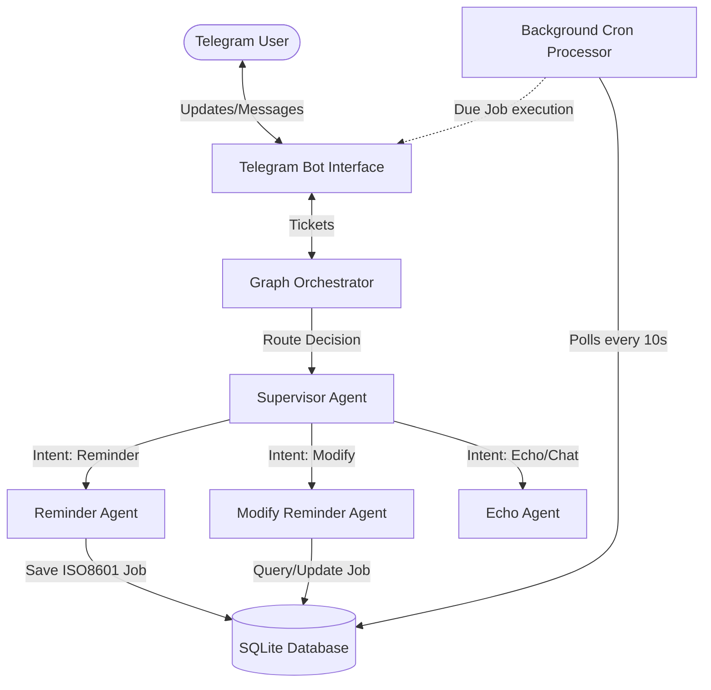

# Autonomous Lifecycle Orchestrator

A sophisticated, Go-based multi-agent architecture designed to function as an autonomous personal assistant via Telegram. Powered by Google's Gemini 2.5 Flash, the system utilizes a supervisor-worker pattern to dynamically route natural language requests to specialized AI agents.

## System Architecture

The orchestrator leverages a graph-based execution flow. A central Supervisor Agent analyzes incoming conversation history, determines the user's intent, and routes the context to the appropriate specialized Worker Agent.



### Core Components

1.  **Telegram Bot Interface (`internal/bot/telegram.go`)**
    *   Handles long-polling for incoming messages.
    *   Maintains conversation history within a `TicketState` session.
    *   Exposes a public `SendMessage` method for proactive agent notifications.

2.  **Supervisor Agent (`internal/agents/supervisor.go`)**
    *   Acts as the primary intent classifier.
    *   Uses a zero-shot LLM prompt to analyze conversation history and select a predefined routing path (e.g., `REMINDER`, `MODIFY_REMINDER`, `ECHO`).

3.  **Proactive Scheduler (`internal/agents/reminder.go` & `internal/bot/cron.go`)**
    *   **Reminder Agent:** Parses complex natural language time requests into strict ISO-8601 formats and persists them to SQLite.
    *   **Cron Processor:** Runs a continuous background goroutine, polling the SQLite database for expired jobs and proactively dispatching them to the user via Telegram.
    *   **Modify Agent:** Fetches pending jobs, feeds the context to the LLM, and accurately identifies the exact Job ID the user wishes to update or cancel.

4.  **Database Layer (`internal/db/sqlite.go`)**
    *   Managed via `mattn/go-sqlite3`.
    *   Maintains the `reminders.db` state within the `data/` directory.

## Getting Started

### Prerequisites
*   Go 1.22+
*   A Telegram Bot Token (via BotFather)
*   A Google Gemini API Key
*   Your personal Telegram Chat ID

### Environment Configuration
Copy the sample environment file and populate your specific credentials:

```bash
cp .env.example .env
```

Ensure the `.env` file contains:
```env
GEMINI_API_KEY=your_gemini_api_key
TELEGRAM_BOT_TOKEN=your_telegram_bot_token
ADMIN_CHAT_ID=your_telegram_chat_id
```

### Running the Application

To start the autonomous Telegram bot and the background cron processor:

```bash
go run cmd/bot/main.go
```

To run a simulated CLI query without Telegram (useful for testing agent routing):

```bash
go run cmd/server/main.go
```

## Future Extensibility

The `GraphOrchestrator` allows for horizontal scaling of capabilities. To add a new capability (e.g., Note Taking, Financial Tracking):
1. Create a new `Agent` struct implementing the `Execute` interface.
2. Add a new route identifier to the `SupervisorAgent` prompt.
3. Inject the new agent into the `GraphOrchestrator.Run` switch statement.
